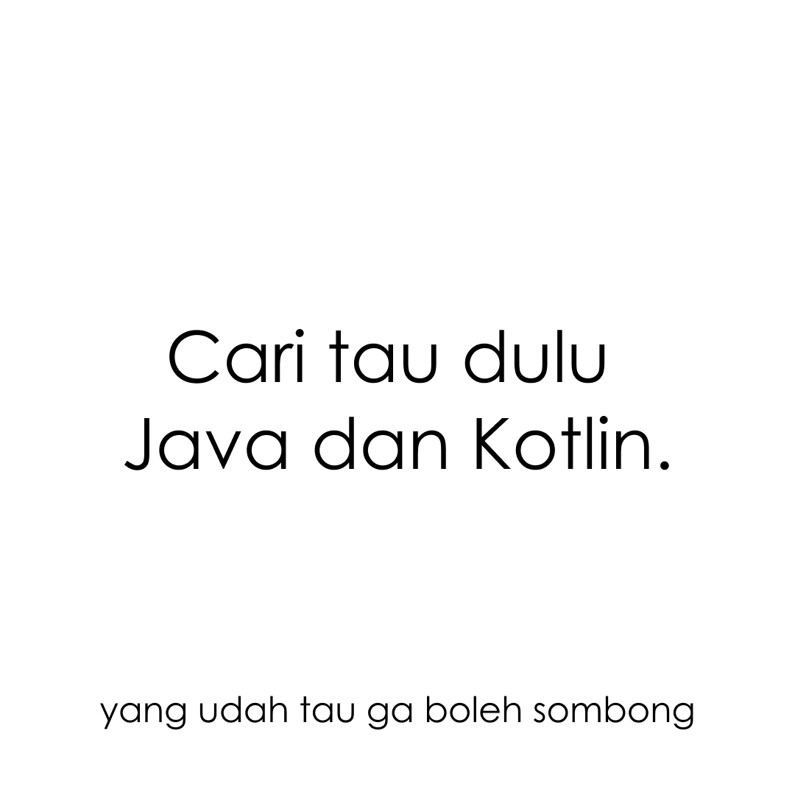

## Feed Post-2 (Corousel)

<table>
  <tr>
    <td></td>
    <td></td>
    <td></td>
  </tr>
</table>

<table> 
  <tr>
    <td></td>
    <td></td>
    <td></td>
  </tr>
</table>

## Caption
Jadi gini mimin comeback dan langsung ngasih nasehat
.
.
.
Gimana sih caranya buat aplikasi android gmn? gmn?
yang tau jawab di kolom komentar ya

## Hastag
#androiddeveloper
