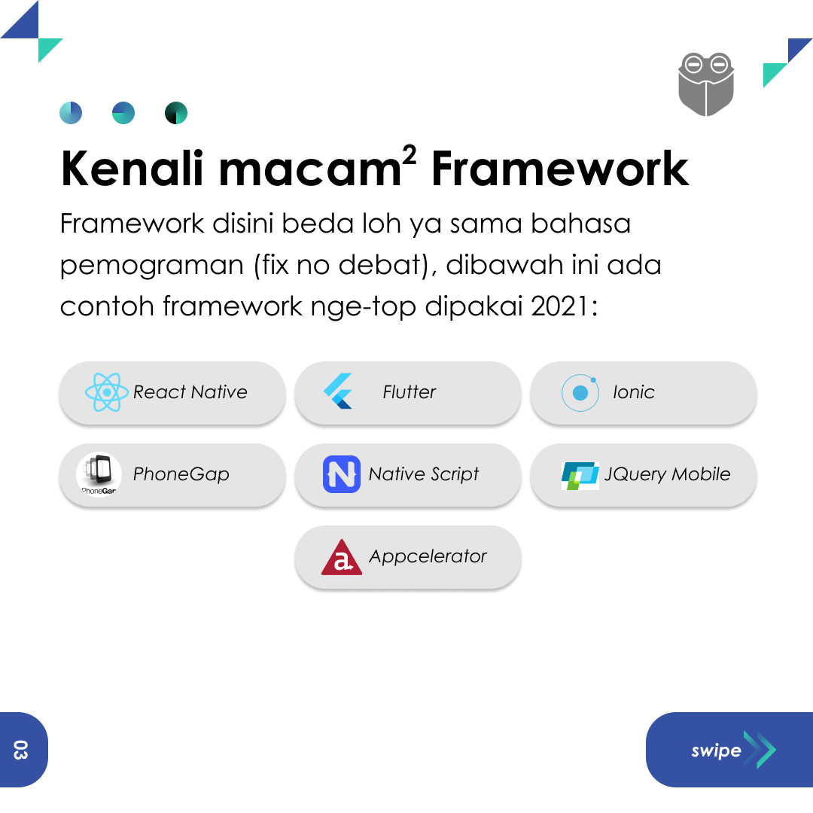
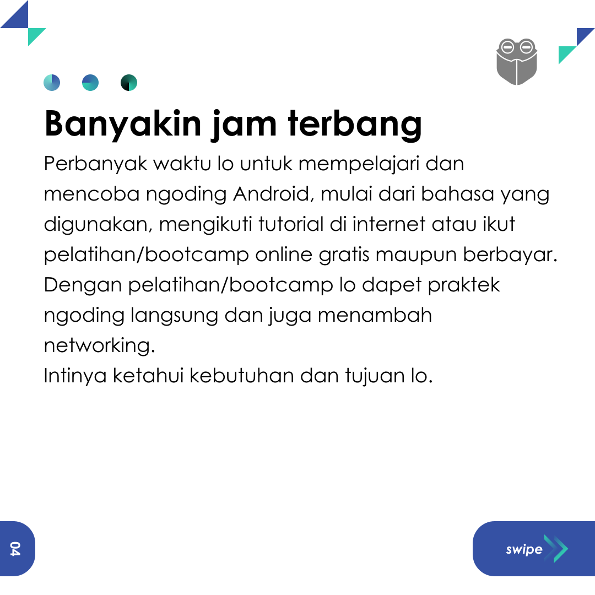
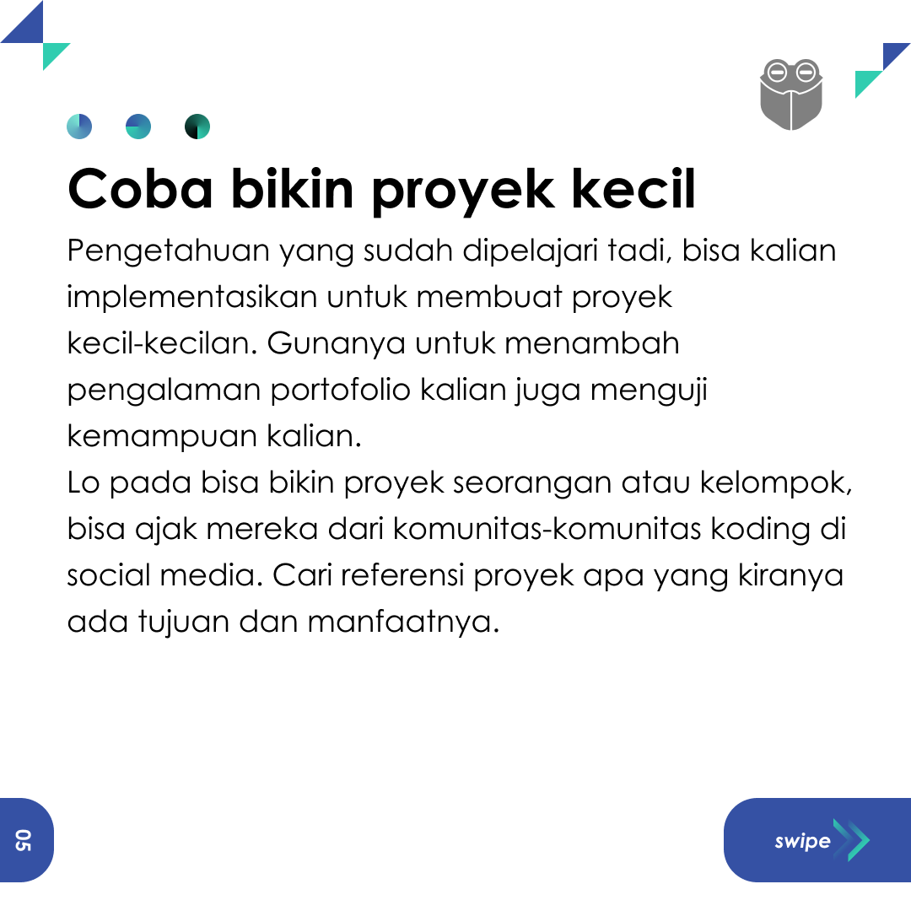
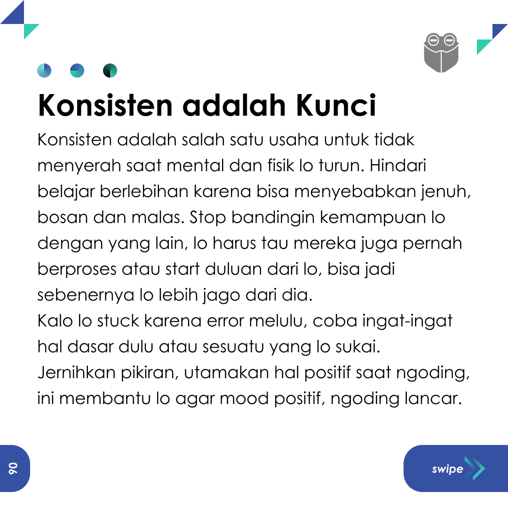
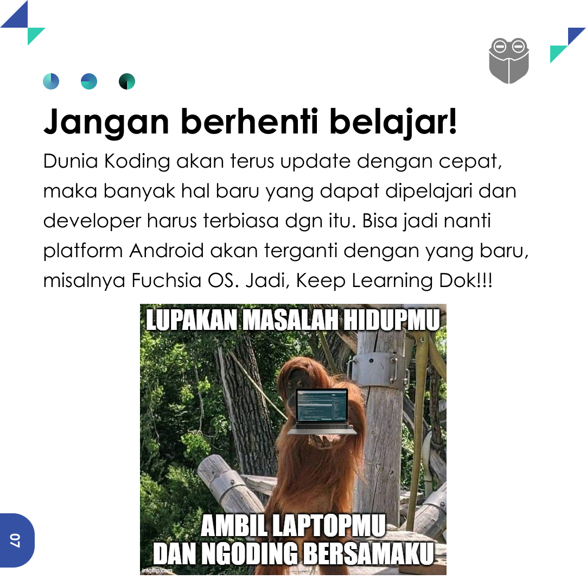

## Feed Post-4 (Corousel)

<table>
  <tr>
    <td></td>
    <td></td>
    <td></td>
  </tr>
</table>

<table>
  <tr>
    <td></td>
    <td></td>
    <td></td>
  </tr>
</table>
<table>
  <tr>
    <td></td>
    <td></td>
    <td></td>
  </tr>
</table>

## Caption
Caption (Resume)

Ini nih yang bikin lo jago buat ngoding Android:
1. Kuasai IDE yang akan dipilih
2. Kenalan dulu dengan macam-macam Framework Android
3. Banyakin jam terbang
4. Coba bikin proyek-proyek kecil
5. Konsisten adalah Kunci
6. Jangan berhenti belajar!

Menurut kalian apa lagi yang bikin lo jago buat ngoding??

## Hastag
#android #androiddev #programming #developer #itdeveloper #androiddeveloper #androiddeveloperindonesia #ngoding #android #VSCode #frogobox

